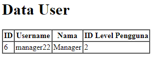
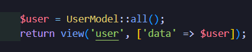
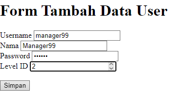

# A. PROPERTI $fillable DAN $guarded
1. Buka file model dengan nama UserModel.php dan tambahkan $fillable 

2. Buka file controller dengan nama UserController.php dan ubah script untuk menambahkan data baru   
  
3. Simpan kode program Langkah 1 dan 2, dan jalankan perintah web server. Kemudian jalankan link localhostPWL_POS/public/user pada browser  
  
4. Ubah file model UserModel.php seperti pada gambar di bawah ini pada bagian $fillabl  

5. Ubah kembali file controller UserController.php seperti pada gambar di bawah hanya bagian array pada $data  
   
6. Simpan kode program Langkah 4 dan 5. Kemudian jalankan pada browser dan amati apa yang terjadi   
  
7. Kebalikan dari $fillable adalah $guarded. Semua kolom yang kita tambahkan ke $guarded akan diabaikan oleh Eloquent ketika kita melakukan insert/update. Secara default $guarded isinya array("*"), yang berarti semua atribut tidak bisa diset melalui mass assignment (jabarkan istilah ini)   

# B. RETRIEVING SINGLE MODELS
## 2.1 etrieving Single Models
1. Buka file controller dengan nama UserController.php dan ubah script   
  
2. Buka file view dengan nama user.blade.php dan ubah script  
   
3. Simpan kode program Langkah 1 dan 2. Kemudian jalankan link http://localhost:8000/user pada browser   
  
4. Ubah file controller dengan nama UserController.php dan ubah script   
  
5. Simpan kode program Langkah 4. Kemudian jalankan link http://localhost:8000/user pada browser
  
6. Ubah file controller dengan nama UserController.php dan ubah script
  
7. Simpan kode program Langkah 6. Kemudian jalankan link http://localhost:8000/user pada browser dan amati  
  
8. Ubah file controller dengan nama UserController.php dan ubah script  
  
9. Simpan kode program Langkah 8. Kemudian jalankan link http://localhost:8000/user pada browser dan amati   
   
10. Ubah file controller dengan nama UserController.php dan ubah script 
   
11. Simpan kode program Langkah 10. Kemudian jalankan link http://localhost:8000/user pada browser dan amati
   

## 2.2 Not Found Exceptions
1. Ubah file controller dengan nama UserController.php dan ubah script   
  
2. Simpan kode program Langkah 1. Kemudian jalankan pada browser dan amati apa yang terjadi  
  
3. Ubah file controller dengan nama UserController.php dan ubah script  
  
4. Simpan kode program Langkah 3. Kemudian jalankan pada browser dan amati apa yang terjadi  
   

## 2.3 Retreiving Aggregrates
1. Ubah file controller dengan nama UserController.php dan ubah script   
   
2. Simpan kode program Langkah 1. Kemudian jalankan pada browser   
   
3. Buat agar jumlah script pada langkah 1 bisa tampil pada halaman browser, sebagai contoh bisa lihat gambar di bawah ini dan ubah script pada file view supaya bisa muncul datanya
   
   

## 2.4 Retreiving or Creating Models
1. Ubah file controller dengan nama UserController.php dan ubah script 
   
2. Ubah kembali file view dengan nama user.blade.php dan ubah script  
   
3. Simpan kode program Langkah 1 dan 2. Kemudian jalankan pada browser dan amati apa yang terjadi 
   
4. Ubah file controller dengan nama UserController.php dan ubah script  
   
5. Simpan kode program Langkah 4. Kemudian jalankan pada browser dan amati apa yang terjadi dan cek juga pada phpMyAdmin pada tabel m_user   
   
   
6. Ubah file controller dengan nama UserController.php dan ubah script  
   
7. Simpan kode program Langkah 6. Kemudian jalankan pada browser dan amati  
   
8. Ubah file controller dengan nama UserController.php dan ubah script  
   
9. Simpan kode program Langkah 8. Kemudian jalankan pada browser dan amati apa yang terjadi dan cek juga pada phpMyAdmin pada tabel m_user  
   
10. Ubah file controller dengan nama UserController.php dan ubah script  
   
11. Simpan kode program Langkah 9. Kemudian jalankan pada browser dan amati apa yang terjadi dan cek juga pada phpMyAdmin pada tabel m_user  
   

## 2.5 Attribute Changes
1. Ubah file controller dengan nama UserController.php dan ubah script seperti gambar di bawah ini  
   
2. Simpan kode program Langkah 1. Kemudian jalankan pada browser dan amati apa yang terjadi dan beri penjelasan dalam laporan  
   
3. Ubah file controller dengan nama UserController.php dan ubah script seperti gambar di bawah ini  
   
4. Simpan kode program Langkah 3. Kemudian jalankan pada browser dan amati apa yang terjadi dan beri penjelasan dalam laporan  

## 2.6 CRUD
1. Buka file view pada user.blade.php dan buat scritpnya menjadi seperti di bawah ini  
   
2. Buka file controller pada UserController.php dan buat scriptnya untuk read menjadi seperti di bawah ini  
   
3. Simpan kode program Langkah 1 dan 2. Kemudian jalankan pada browser dan amati apa yang terjadi dan beri penjelasan dalam laporan  
   
4. Langkah berikutnya membuat create atau tambah data user dengan cara bikin file baru pada view dengan nama user_tambah.blade.php dan buat scriptnya menjadi seperti di
bawah ini  
   
5. Tambahkan script pada routes dengan nama file web.php. Tambahkan seperti gambar di bawah ini  
   
6. Tambahkan script pada controller dengan nama file UserController.php. Tambahkan script dalam class dan buat method baru dengan nama tambah dan diletakan di bawah method index seperti gambar di bawah ini
   
7. Simpan kode program Langkah 4 s/d 6. Kemudian jalankan pada browser dan klik link “+ Tambah User” amati apa yang terjadi dan beri penjelasan dalam laporan  
   
8. Tambahkan script pada routes dengan nama file web.php. Tambahkan seperti gambar di bawah ini  
   
9. Tambahkan script pada controller dengan nama file UserController.php. Tambahkan script dalam class dan buat method baru dengan nama tambah_simpan dan diletakan di bawah method tambah seperti gambar di bawah ini  
   
10. Simpan kode program Langkah 8 dan 9. Kemudian jalankan link localhost:8000/user/tambah atau localhost/PWL_POS/public/user/tambah pada browser dan input formnya dan simpan, kemudian amati apa yang terjadi dan beri penjelasan dalam laporan  
   
11. Langkah berikutnya membuat update atau ubah data user dengan cara bikin file baru pada view dengan nama user_ubah.blade.php dan buat scriptnya menjadi seperti di bawah ini 
   
12. Tambahkan script pada routes dengan nama file web.php. Tambahkan seperti gambar di bawah ini  
   
13. Tambahkan script pada controller dengan nama file UserController.php. Tambahkan script dalam class dan buat method baru dengan nama ubah dan diletakan di bawah method tambah_simpan seperti gambar di bawah ini  
   
14. Simpan kode program Langkah 11 sd 13. Kemudian jalankan pada browser dan klik link “Ubah” amati apa yang terjadi dan beri penjelasan dalam laporan  
   
15. Tambahkan script pada routes dengan nama file web.php. Tambahkan seperti gambar di bawah ini  
   
16. Tambahkan script pada controller dengan nama file UserController.php. Tambahkan script dalam class dan buat method baru dengan nama ubah_simpan dan diletakan di bawah method ubah seperti gambar di bawah ini  
   
17. Simpan kode program Langkah 15 dan 16. Kemudian jalankan link localhost:8000/user/ubah/1 atau localhost/PWL_POS/public/user/ubah/1 pada browser dan ubah input formnya dan klik tombol ubah, kemudian amati apa yang terjadi dan beri penjelasan dalam laporan  
   
18. Berikut untuk langkah delete . Tambahkan script pada routes dengan nama file web.php. Tambahkan seperti gambar di bawah ini  
   
19. Tambahkan script pada controller dengan nama file UserController.php. Tambahkan script dalam class dan buat method baru dengan nama hapus dan diletakan 
   
20. Simpan kode program Langkah 18 dan 19. Kemudian jalankan pada browser dan klik tombol hapus, kemudian amati apa yang terjadi dan beri penjelasan dalam laporan  
   
   

## 2.7 Relationships
1. Buka file model pada UserModel.php dan tambahkan scritpnya menjadi seperti di bawah ini
   
2. Buka file controller pada UserController.php dan ubah method script menjadi seperti di bawah ini
   
3. Simpan kode program Langkah 2. Kemudian jalankan link pada browser, kemudian amati apa yang terjadi dan beri penjelasan dalam laporan

